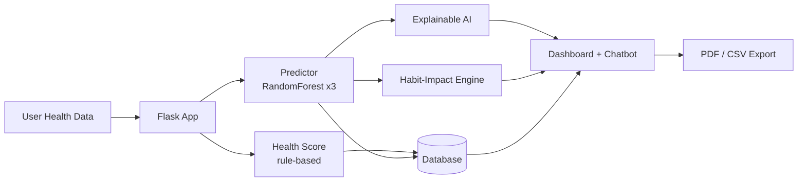

<div align="center">

# 🩺 AI Personalized Health Digital Twin

### with Predictive Risk Intelligence

A full-stack **Flask + Machine Learning** application that builds a virtual *Digital Twin* of each user's health, predicts chronic disease risk, explains **why**, and shows the **single highest-impact habit** to change.


[Features](#-features) · [Tech Stack](#-tech-stack) · [Quick Start](#-quick-start) · [User Roles](#-user-roles) · [ML Models](#-how-the-ml-models-work) · [Author](#-author)

</div>

---

## 📖 Overview

Most health-risk projects stop at a single prediction. This one goes further:

| Question | How the Digital Twin answers it |
|---|---|
| **What is my risk?** | RandomForest models predict diabetes, hypertension and heart disease risk |
| **Why is it high?** | Explainable AI ranks the top contributing factors per prediction |
| **What if I change my lifestyle?** | Live What-If sliders re-run the ML models instantly via AJAX |
| **What should I change first?** | Habit-Impact Ranking Engine ranks habits by predicted risk reduction |

> ⚠️ **Disclaimer:** This is an educational/demo project and is not a substitute for professional medical advice.

---

## ✨ Features

### 🧠 Core Intelligence

- **ML Health Score & Risk Prediction**: RandomForest (scikit-learn), one model per disease
- **Health Score Decomposition**: radar chart of Metabolic, Cardiovascular, Sleep and Activity sub-scores
- **What-If Simulation**: live sliders that re-run the models in real time
- **Habit-Impact Ranking Engine** ⭐: counterfactual analysis ranking lifestyle changes by risk reduction *(signature feature)*
- **Explainable AI**: top contributing factors for every prediction
- **Risk Trend Forecasting**: linear-regression projection of Health Score and risk at 30/60/90 days
- **Personalized Recommendations**
- **Conversational Twin Chatbot**: ask *"why is my heart risk high?"* or *"what's my biggest opportunity?"*; answered from your real data with rule-based intent matching (no external API or LLM needed)

### 👥 Accounts & Security

- Registration and login with **email OTP verification** (6-digit code, 10-minute expiry)
- **Passwordless OTP login** as an alternative to password login
- **Forgot Password** via email OTP
- **Role-based access**: Patient, Doctor and Admin, each with separate views
- **Login Activity Log** (Account → Security)
- **Privacy & Consent page** with download-my-data and delete-my-account controls

### 🏥 Care & Engagement

- **Doctor Dashboard**: read-only view of every patient's full Digital Twin
- **Appointment Booking**: patients request, doctors confirm or decline
- **SOS Critical Risk Alert**: automatic email and on-screen warning if any predicted risk crosses **80%**
- **Health Goals & Progress Tracking**: set a target score and date, track with a progress bar
- **Gamified Check-in Streaks**: weekly logging streak badge
- **Health Timeline**: historical trend charts

### 📤 Export & Usability

- **Doctor-Share Mode**: one-click PDF clinical summary
- **Export Health Data as CSV**
- **Print-Friendly Dashboard**
- **Dark Mode** (persisted with `localStorage`)
- **Admin Panel**: all users, roles and verification status
- **About the Developer** page

---

## 🛠 Tech Stack

| Layer | Technologies |
|---|---|
| **Backend** | Python, Flask |
| **Database** | SQLite (demo), MySQL (production-ready schema included) |
| **ML / Data** | Scikit-learn, Pandas, Joblib |
| **Frontend** | HTML, CSS, JavaScript, Bootstrap 5, Chart.js |
| **Reports** | ReportLab (PDF generation) |

---

## 🏗 Architecture



---

## 👤 User Roles

| Role | How to create | What they see |
|---|---|---|
| **Patient** | Self-register at `/register` (role: Patient) | Own dashboard, timeline, chatbot, PDF report |
| **Doctor** | Self-register at `/register` (role: Doctor) with the access code (default `DOCTOR2026`, override with the `DOCTOR_ACCESS_CODE` env var) | Read-only view of all patients |
| **Admin** | Run `python create_staff.py` (not self-registerable, for security) | All registered users, roles and verification status |

---

## 🚀 Quick Start

### Prerequisites

- Python 3.9+
- `pip`

### Installation

```bash
# 1. Clone the repository
git clone https://github.com/shivasaisanga/health-digital-twin.git
cd health-digital-twin

# 2. Install dependencies
pip install -r requirements.txt

# 3. Train the ML models (creates models/*.joblib and models/health_data.csv)
python models/train_model.py

# 4. Start the app
python app.py
```

Then open **http://127.0.0.1:5000** in your browser.

The app uses **SQLite** by default, so no setup is needed. `health_twin.db` is created automatically in `database/`.

### 📧 Email OTP Setup (optional)

Without email credentials, OTPs appear on screen in a flash message clearly labeled **DEMO MODE**, so you can demo and test without any setup.

To send real emails:

1. Use a Gmail account with **2-Step Verification** enabled.
2. Generate an **App Password** at <https://myaccount.google.com/apppasswords>.
3. Set the environment variables, then run `python app.py`:

```bash
# Windows PowerShell
$env:SMTP_EMAIL="youraccount@gmail.com"
$env:SMTP_PASSWORD="your16digitapppassword"

# macOS / Linux
export SMTP_EMAIL="youraccount@gmail.com"
export SMTP_PASSWORD="your16digitapppassword"
```

### 🗄 Switching to MySQL (production)

1. `pip install pymysql`
2. Create the database and run `database/schema.sql` on your MySQL server.
3. In `database/db.py`, replace the body of `get_connection()` with a `pymysql.connect(...)` call using your host, user, password and database.

The rest of the app stays unchanged, since all SQL used is standard ANSI syntax compatible with both SQLite and MySQL.

---

## 📁 Project Structure

```text
health_twin/
├── app.py                  # Main Flask application & routes
├── create_staff.py         # CLI script to create Doctor/Admin accounts
├── requirements.txt
├── models/
│   ├── train_model.py      # Generates synthetic data + trains ML models
│   ├── *.joblib            # Trained models (generated)
│   └── health_data.csv     # Synthetic training dataset (generated)
├── database/
│   ├── db.py               # SQLite data access layer (swap for MySQL)
│   └── schema.sql          # MySQL DDL for production
├── utils/
│   ├── health_score.py     # Rule-based Health Score + sub-score formulas
│   ├── predictor.py        # Loads models, runs risk predictions
│   ├── xai.py              # Explainable AI factor ranking
│   ├── habit_impact.py     # Habit-Impact Ranking Engine (counterfactuals)
│   ├── recommendations.py  # Personalized recommendation rules
│   ├── email_otp.py        # OTP generation + email sending (demo fallback)
│   ├── chatbot.py          # Rule-based Conversational Twin chatbot
│   └── pdf_report.py       # Doctor-Share Mode PDF generator
├── templates/              # Jinja2 + Bootstrap 5 HTML templates
└── static/css/style.css    # Custom styling incl. dark mode
```

---

## 🤖 How the ML Models Work

`models/train_model.py` generates a **6,000-row synthetic dataset** with medically plausible relationships, for example glucose and BMI driving diabetes risk, and blood pressure, age and smoking driving hypertension and heart disease risk.

One `RandomForestClassifier` is trained per disease, reaching **AUC ≈ 0.91–0.93** on held-out test data.

**Using a real dataset:** adapt the feature columns in `train_model.py` (e.g. Pima Indians Diabetes, Framingham Heart Study, Cleveland Heart Disease). The predictor, XAI and habit-impact engine keep working as long as the feature names in `models/feature_names.joblib` line up.

### 💡 Key Design Decisions

- **Habit-Impact Ranking Engine** (`utils/habit_impact.py`): re-runs the trained models on modified copies of the user's profile, one variable at a time, and ranks the resulting risk reduction. This is a lightweight form of counterfactual explainability that most academic health-risk projects don't include.
- **Rule-based sub-scores**: the Health Score sub-scores are intentionally not ML, so they update instantly for the What-If Simulation and are easy to justify and explain.

---

## 🗺 Roadmap

- [ ] Train on a real clinical dataset
- [ ] Wearable / IoT data integration
- [ ] Docker deployment

---

## 👨‍💻 Author

**Sanga Shiva Sai**
MCA Student, Anurag University · AI & ML Intern

[](https://github.com/shivasaisanga)
[](https://linkedin.com/in/shiva-sai-b15a2b253)

---

<div align="center">

⭐ If you found this project useful, consider giving it a star!

</div>
